# VentasFix

*Última actualización: 15 de septiembre de 2026.*

## Información de la entrega

- **Proyecto**: VentasFix — software de ventas online y gestión de stock
- **Asignatura**: Desarrollo de Software Web I
- **Autor**: Cristóbal Bustos
- **Fecha de entrega**: 15 de septiembre de 2026

## 1. Resumen del proyecto

### 1.1 Qué es VentasFix

VentasFix es una plataforma de backoffice para la venta online de
productos y el control de inventario asociado. El sistema administra
tres entidades núcleo — Usuario (personal interno que opera el
sistema), Producto (catálogo con niveles de stock) y Cliente (empresas
compradoras, venta B2B) — y expone un dashboard con indicadores
agregados del negocio (conteo total de cada entidad). Toda la
funcionalidad de negocio se implementa primero como API REST
(**API first**), y las vistas web consumen esa misma API sin duplicar
lógica de negocio en el frontend.

### 1.2 Decisión de alcance

#### 1.2.1 Núcleo completo: Usuario, Producto, Cliente, Dashboard, Autenticación

Esta entrega implementa y verifica exhaustivamente el núcleo completo
exigido por el enunciado: CRUD de las tres entidades (vía API y vía
vistas web equivalentes), autenticación con JWT, dashboard con
conteos reales, subida de imagen de producto, documentación OpenAPI
generada desde los mismos esquemas de validación, y un conjunto de
validaciones de negocio (formato de RUT chileno, dominio de email,
límites de longitud/rango, cifrado de contraseñas) que van más allá
del mínimo especificado, resultado de rondas de pruebas adversariales
sobre cada mantenedor.

#### 1.2.2 Venta/DetalleVenta como backlog documentado

El enunciado original del examen no exige un módulo de ventas
propiamente dicho, y la rúbrica no lo evalúa. Durante el
levantamiento inicial de requerimientos se identificó esta ausencia
como una entidad "faltante" para que el sistema fuera plenamente "de
ventas" (según su nombre), y se modeló su diseño (Venta y
DetalleVenta, con descuento transaccional de stock) en
[`docs/BRIEF.md`](docs/BRIEF.md) §3.4/3.5, quedando explícitamente
fuera del alcance de esta entrega y documentada como trabajo futuro,
para priorizar la robustez del núcleo dentro del tiempo disponible.

## 2. Arquitectura

### 2.1 Las dos aplicaciones (`ventasfix-api`, `ventasfix-web`)

El proyecto sigue un patrón cliente-servidor con dos aplicaciones
Next.js independientes, cada una con su propio `package.json`,
dependencias y ciclo de vida:

- **`ventasfix-api`**: usada exclusivamente como servidor de rutas
  (`app/api/**/route.ts`) — no tiene páginas ni vistas, solo endpoints
  que devuelven JSON. Es la única fuente de verdad del dominio: todo
  el CRUD, la validación con Zod, el acceso a datos vía Prisma y la
  autenticación de negocio viven aquí.
- **`ventasfix-web`**: consume `ventasfix-api` por HTTP. No tiene
  acceso directo a la base de datos ni implementa lógica de negocio —
  solo UI/UX y el BFF de autenticación (ver 2.2).

### 2.2 Patrón BFF (Backend for Frontend)

La autenticación sigue un flujo BFF en vez de exponer el JWT al
navegador:

1. El navegador hace login contra una route handler propia de
   `ventasfix-web` (`app/api/login/route.ts`).
2. Esa route handler reenvía las credenciales a `ventasfix-api`, que
   las valida y responde con un JWT firmado.
3. `ventasfix-web` recibe el JWT en su propio servidor y lo setea como
   cookie `httpOnly`, `secure` (en producción) y `sameSite: 'lax'` en
   la respuesta al navegador — el token nunca viaja en el body de la
   respuesta ni se guarda en `localStorage` o estado de cliente.

Todas las llamadas de negocio posteriores (CRUD de Usuario, Producto,
Cliente, dashboard) siguen el mismo patrón: pasan por route handlers
propias de `ventasfix-web` que reenvían la petición a `ventasfix-api`
adjuntando el JWT desde la cookie. Ningún componente del navegador
llama directo a `ventasfix-api`.

### 2.3 Monorepo sin workspaces

Ambas aplicaciones viven en un mismo repositorio Git por conveniencia
(un solo lugar para código y documentación), pero no comparten
`node_modules` ni usan `npm`/`pnpm` workspaces — cada carpeta se
instala y ejecuta por separado. Como consecuencia, algunas piezas de
lógica compartida entre ambas apps (ej. el validador de RUT chileno)
están intencionalmente duplicadas en cada una, en vez de extraídas a
un paquete común.

## 3. Stack y decisiones técnicas

### 3.1 Justificación de cada elección

**Next.js (App Router) para ambas aplicaciones.** Se optó por dos
aplicaciones Next.js independientes (`ventasfix-web` y `ventasfix-api`)
en vez de un framework de backend separado, para reutilizar el mismo
lenguaje, tooling y convenciones de carpetas en todo el proyecto —
una sola herramienta que aprender y mantener en vez de dos. En
`ventasfix-api`, Next.js se usa exclusivamente como servidor de rutas
(`app/api/**/route.ts`): no expone páginas ni vistas, solo endpoints
JSON, reemplazando lo que normalmente sería Express sin sumar una
dependencia de servidor HTTP aparte.

**Prisma como ORM.** Genera un cliente fuertemente tipado directamente
desde el esquema declarativo (`schema.prisma`), lo que da *type-safety*
en tiempo de compilación entre los modelos y el código que los consume,
además de manejar migraciones versionadas de forma nativa — un
requisito explícito del enunciado (BRIEF.md §6).

**SQLite como motor de base de datos.** Suficiente para el alcance de
este proyecto (una sola instancia, sin carga concurrente significativa)
y elimina la necesidad de levantar un servicio de base de datos externo
para desarrollo o evaluación. Prisma permite migrar a Postgres o MySQL
cambiando solo el `datasource` del schema si el proyecto creciera.

**Zod para validación.** Una sola definición de esquema alimenta tres
cosas distintas: la validación de entrada en cada endpoint (API y
frontend), el tipado de TypeScript inferido automáticamente, y la
documentación OpenAPI generada a partir de los mismos esquemas
(`zod-openapi`) — evita mantener tres definiciones separadas que
podrían desincronizarse con el tiempo.

**argon2 para el hash de contraseñas.** Variante Argon2id, el estándar
recomendado actualmente por OWASP para hasheo de contraseñas, con mejor
resistencia a ataques por fuerza bruta basados en GPU que alternativas
más antiguas como bcrypt.

**jose para JWT.** A diferencia de `jsonwebtoken`, `jose` implementa la
Web Crypto API de forma nativa (estándar JOSE), lo que garantiza
portabilidad entre runtimes — funciona igual en Node.js y en Edge
Runtime sin depender de los módulos criptográficos internos de Node.
Esta portabilidad fue la razón real de su elección, no una atadura a
un runtime específico (ver 3.3.1).

**Patrón BFF (Backend for Frontend) para la autenticación.** El
navegador nunca recibe el JWT directamente: hace login contra una
route handler propia de `ventasfix-web`, que reenvía las credenciales a
`ventasfix-api`, recibe el JWT, y lo setea como cookie `httpOnly`,
`secure` (en producción) y `sameSite: 'lax'`. El token nunca es
accesible desde JavaScript del cliente, lo que cierra la superficie de
ataque de robo de token vía XSS.

**Bootstrap 5** para estilos y componentes UI, por ser una librería
madura, ampliamente documentada, y suficiente para los patrones de
backoffice que requiere el proyecto (formularios, modales, tablas,
badges) sin necesidad de un design system más pesado.

### 3.2 Alternativas consideradas y descartadas

**Next.js vs. Express/Django/Laravel para el backend.** Un framework de
backend tradicional (Express, Django, Laravel) ofrece más flexibilidad
de configuración de servidor, pero habría significado dos lenguajes o
ecosistemas distintos entre frontend y backend. Se priorizó reducir el
cambio de contexto y reutilizar el mismo tooling (TypeScript, ESLint,
Vitest) en ambas aplicaciones.

**Prisma vs. SQL crudo o micro-ORMs.** Escribir SQL directamente da
control total sin ninguna capa de abstracción, pero renuncia al tipado
automático y aumenta el riesgo de errores en tiempo de ejecución por
consultas mal construidas. Para el volumen de CRUD de este proyecto
(tres entidades con relaciones simples), el beneficio de *type-safety*
superó la pérdida de control granular.

**SQLite vs. Postgres/MySQL.** Un motor cliente-servidor real ofrece
mejor concurrencia de escritura, pero introduce una dependencia externa
que complica la instalación local para evaluación — exactamente el tipo
de fricción que el enunciado busca evitar al pedir un README con
"instrucciones de instalación y ejecución local" simples.

**jsonwebtoken vs. jose.** `jsonwebtoken` es más común en tutoriales y
ejemplos, pero depende de los módulos criptográficos internos de
Node.js, lo que limita su portabilidad a otros runtimes. `jose` se
eligió por esa portabilidad, independientemente de si el proyecto
finalmente corre en Edge Runtime o no (ver 3.3.1).

### 3.3 Gotchas y decisiones puntuales

#### 3.3.1 Webpack vs. Turbopack

Next.js 16 usa Turbopack por defecto, pero un bug conocido en Windows
([vercel/next.js#86431](https://github.com/vercel/next.js/issues/86431))
impide que resuelva correctamente los `@import` relativos de Sass
dentro de `node_modules` — necesarios para compilar Bootstrap desde su
fuente (ver 3.3.2). `ventasfix-web` corre con `--webpack` como
workaround documentado; `ventasfix-api` no se vio afectado, al no usar
Sass.

#### 3.3.2 Bootstrap compilado desde Sass propio

Sobrescribir las variables CSS de Bootstrap (`--bs-primary`, etc.) en
`:root` no alcanza: los componentes (`.btn-primary`, `.badge`, etc.)
fijan sus valores en tiempo de compilación Sass a partir de las
variables `$primary`, etc. — sobrescribir la variable CSS después solo
afecta a las utilidades (`.text-primary`, `.bg-primary`), no a los
componentes. La solución fue compilar Bootstrap desde su fuente Sass
(`bootstrap-custom.scss`) con las variables de marca definidas
*antes* del `@import` de Bootstrap, para que todos los componentes
generen sus valores con los colores correctos desde el origen.

#### 3.3.3 Password opcional en actualización de Usuario

El endpoint `GET /api/usuarios/:id` nunca devuelve el password (ni su
hash), por diseño de seguridad — así que "dejar el campo vacío para no
cambiar la contraseña" no puede resolverse reenviando un valor que el
backend nunca expuso. La solución fue que el esquema de actualización
en la API acepte `password` como opcional: si no se envía, el campo
simplemente se omite del `update` de Prisma, dejando la columna intacta
en la base de datos sin necesidad de leer ni reescribir el hash
existente.

#### 3.3.4 Límites de validación (longitud/rango) explícitos

Los tipos de dato por sí solos no bastan como validación de negocio: un
número dentro del rango de un `Float` de Prisma puede seguir siendo
absurdo para el dominio (ej. un precio de un billón), y un `String` sin
límite de longitud puede romper el layout de una tabla HTML mucho antes
de agotar cualquier límite de base de datos. Se agregaron límites
explícitos de rango y longitud en los esquemas Zod de ambas
aplicaciones para cada campo numérico y de texto, más allá de lo que el
tipo de dato garantiza por sí mismo.

#### 3.3.5 Auto-eliminación de Usuario y guard del último usuario

El sistema permite que un usuario elimine su propia cuenta (no hay
sistema de roles que lo impida, fuera del alcance según BRIEF.md §2),
pero con dos resguardos: no se puede eliminar el último usuario
existente (evita quedar sin ningún acceso al sistema), y si el usuario
eliminado es el mismo que tiene la sesión activa, el frontend fuerza el
logout inmediato en vez de dejar una sesión "fantasma" con un JWT
técnicamente válido pero de un usuario que ya no existe.

## 4. Limitaciones conocidas

**Concurrencia de escritura en SQLite.** El motor de base de datos usa
un único archivo (`dev.db`); su modelo de bloqueo no soporta escrituras
simultáneas de múltiples procesos con buen rendimiento. Adecuado para
el alcance de esta evaluación (una instancia, sin carga concurrente
real), pero un despliegue de producción con múltiples usuarios
escribiendo a la vez debería migrar a un motor cliente-servidor
(Postgres o MySQL) — cambio que Prisma permite haciendo únicamente
sin tocar el resto del código de acceso a datos.

**Sin sistema de roles y permisos granulares.** Todo Usuario autenticado
tiene acceso completo a los tres mantenedores (Usuario, Producto,
Cliente) y al dashboard — no existe una distinción entre, por ejemplo,
un administrador y un operador con permisos limitados. Esto es una
decisión de alcance explícita (BRIEF.md §2: "roles y permisos
granulares" está fuera de alcance), no una omisión.

**Sesión no invalidada al eliminar a otro usuario.** Al eliminar la
propia cuenta, el sistema fuerza el logout inmediato (ver 3.3.5). Sin
embargo, si un usuario es eliminado *por otro* mientras mantiene una
sesión activa en otra pestaña o dispositivo, su JWT sigue siendo
válido — pero cada request protegido verifica que el usuario del token
todavía exista en la base de datos, así que la sesión deja de tener
acceso real desde la siguiente petición, aunque el token en sí no se
revoque hasta su expiración natural (8 horas).

**bfcache con sesión inválida en desarrollo (`next dev`).** Tras
auto-eliminar la cuenta y navegar hacia atrás con el botón del
navegador, el back-forward cache del navegador puede mostrar
brevemente una vista congelada de una sesión ya inválida — `next dev`
sobrescribe internamente el header `Cache-Control: no-store` seteado
en `proxy.ts` (verificado), lo que en producción sí bloquea esa
restauración. Cualquier acción real intentada sobre esa vista
congelada es rechazada por el servidor (401) y redirige a `/login` de
inmediato (`redirectIfUnauthorized`, ver `src/lib/client-fetch.ts`) —
no hay dato expuesto ni operación que se ejecute de verdad, solo una
pantalla vieja hasta el primer clic. En producción (`next start`), el
header llega intacto y el problema no llega a ocurrir.

**Sin pasarela de pago, facturación electrónica (SII), ni múltiples
bodegas/sucursales.** Excluidos explícitamente del alcance desde
BRIEF.md §2, al no ser requeridos por el enunciado del examen.

**Venta y DetalleVenta no implementados.** El enunciado original no
exige un módulo de ventas propiamente dicho, y la rúbrica no lo evalúa.
El modelo de datos y las reglas de negocio para esta extensión quedaron
documentados en BRIEF.md §3.4/3.5 como backlog para una eventual
continuación del proyecto, priorizando en esta entrega la robustez y
cobertura completa del núcleo (Usuario, Producto, Cliente, Dashboard,
Autenticación).

**Sin invalidación activa de tokens (blocklist).** El sistema no
implementa un mecanismo de revocación de JWT antes de su expiración
natural (ej. Redis o una tabla de tokens invalidados) — un cambio de
contraseña o un logout no invalidan tokens ya emitidos que sigan sin
expirar, salvo en el caso específico ya cubierto de auto-eliminación
(3.3.5). Para el tamaño y alcance de este proyecto se consideró un
costo de infraestructura no justificado por el riesgo real.

**Vulnerabilidad reportada por `npm audit` en dependencia transitiva de
Prisma.** `npm audit` en `ventasfix-api` reporta una vulnerabilidad
(CVE-2026-40345, CWE-674 — recursión no controlada / agotamiento de
stack) en `deepmerge-ts`, arrastrada transitivamente vía `prisma` →
`@prisma/config`. Se evaluó conscientemente no aplicar el fix
sugerido (`npm audit fix --force`, que downgradea Prisma 6.19.3 →
6.12.0): la fusión vulnerable solo ocurre dentro de comandos de la CLI
de Prisma en tiempo de desarrollo/build (`generate`, `migrate dev`,
`db seed`), nunca en el cliente generado que usa el servidor en
runtime — explotarla requeriría ya tener acceso de escritura al
repositorio, momento en el cual esta vulnerabilidad puntual deja de
ser la preocupación relevante. El downgrade sugerido introduce más
riesgo real (perder 7 versiones menores de una dependencia ya
verificada) que el que mitiga.

**Sin rate limiting en login.** El endpoint `POST /api/auth/login` no
limita la cantidad de intentos por email o IP en una ventana de
tiempo — un atacante podría intentar fuerza bruta contra una
contraseña sin restricción de velocidad (más allá de la mitigación de
timing attack ya presente, que solo evita distinguir si un email
existe, no protege contra intentos repetidos). No implementado en
esta entrega por no ser requisito del enunciado ni de la rúbrica;
queda documentado como mejora de seguridad para una eventual
continuación (ej. rate limiting por IP/email con ventana deslizante,
usando Redis o una tabla de intentos en la base de datos).

**Advertencia de consola en navegación rápida (RSC prefetch).** Al
cambiar de página muy rápido mientras hay una búsqueda con debounce o
un refresh post-mutación en curso, el navegador puede mostrar "Failed
to fetch RSC payload... Falling back to browser navigation" en
consola. Es un comportamiento reconocido y mitigado por el propio
Next.js (ver código fuente en
next/dist/client/components/router-reducer/fetch-server-response.js)
ante la cancelación de un fetch en vuelo por cambio de página — la
navegación siempre completa correctamente (verificado con pruebas de
navegación agresiva en dev y producción), no requiere ninguna acción.

**Ventana de transición post-login sin sidebar.** Justo después de un
login exitoso, la navegación pasa por una página stub (`/`, fuera del
layout protegido) que redirige server-side a `/dashboard` — en esa
fracción de segundo, el sidebar todavía no existe, así que un clic ahí
no navega a ningún lado; lo que se percibe después es la redirección
que el login ya había puesto en marcha, terminando en `/dashboard` por
su cuenta. Se eliminó un `router.refresh()` redundante que duplicaba
el fetch de datos del dashboard y ensanchaba esta ventana, pero no
puede cerrarse del todo: siempre existe algún intervalo entre el
submit del login y que el sidebar aparezca, dado que hay un salto real
vía `redirect()` server-side. El botón "Iniciar sesión" queda
deshabilitado durante toda la transición, cubriendo el escenario
realista de un clic repetido por impaciencia; un clic cronometrado al
milisegundo exacto en que la URL cambia (fuera de cualquier
interacción humana normal) sigue sin encontrar el sidebar, por diseño
estructural de la transición, no por un bug de código.

**Navegación ocasionalmente redirige a Dashboard en la primera visita
a una ruta bajo `next dev`.** La primera vez que se visita una ruta
protegida en una sesión de desarrollo (ej. Usuarios o Productos recién
después de un `npm run dev` fresco), un clic en el sidebar puede
aterrizar en `/dashboard` en vez de la ruta esperada. Investigado a
fondo: coincide exactamente con la aparición de un hot-update de
webpack (Fast Refresh recompilando esa ruta por primera vez) en vuelo
durante la navegación — el Fast Refresh parece disparar un re-fetch
implícito del árbol de Server Components actualmente visible
(Dashboard), que puede ganar la carrera contra la navegación del
usuario en una ventana angosta y no determinística. Confirmado
exclusivo de desarrollo: 3 corridas completas (9 navegaciones) en
producción (`next start`, sin Fast Refresh) resultaron limpias, sin
ningún rebote. No afecta producción ni el comportamiento real del
sistema — solo la experiencia de desarrollo local bajo `next dev`. Un
segundo clic en la ruta deseada siempre la carga correctamente
(el chunk ya quedó compilado).

## 5. Instalación y ejecución local

### 5.1 Requisitos previos

- **Node.js >= 20.9.0** — requisito de `next@16.3.5` (verificado leyendo
  el `engines` de su propio `package.json`). El repo no fija una versión
  vía `.nvmrc` ni `engines` propio; se verificó funcionando con Node
  v24.14.1.
- npm (el que venga con esa versión de Node).
- Sin requisitos nativos adicionales: `argon2` usa binarios prebuilt para
  las plataformas comunes (Windows/macOS/Linux x64), y Prisma + SQLite
  usa su propio motor de consultas — no hace falta `better-sqlite3` ni un
  compilador C++ para levantar el proyecto.

### 5.2 Variables de entorno

Copiar el `.env.example` de cada app a `.env` **antes** de instalar
dependencias (ver por qué en 5.3):

```bash
cp apps/ventasfix-api/.env.example apps/ventasfix-api/.env
cp apps/ventasfix-web/.env.example apps/ventasfix-web/.env
```

**`apps/ventasfix-api/.env`**

| Variable         | Ejemplo                | Uso |
|------------------|-------------------------|-----|
| `DATABASE_URL`   | `file:./dev.db`         | Conexión SQLite (Prisma) |
| `JWT_SECRET`     | `dev-secret-change-me`  | Firma el JWT de sesión |
| `ADMIN_RUT`      | `11111111-1`            | RUT del usuario admin creado por el seed |
| `ADMIN_EMAIL`    | `admin@ventasfix.cl`    | Email del usuario admin creado por el seed |
| `ADMIN_PASSWORD` | `Admin123!`             | Password del usuario admin creado por el seed |

**`apps/ventasfix-web/.env`**

| Variable              | Ejemplo                | Uso |
|------------------------|-------------------------|-----|
| `API_URL`              | `http://localhost:3001` | Fetch server-to-server hacia `ventasfix-api` (BFF, SSR) |
| `NEXT_PUBLIC_API_URL`  | `http://localhost:3001` | Igual, pero accesible desde el browser (carga de imágenes de producto) |
| `JWT_SECRET`           | `dev-secret-change-me`  | Verifica el JWT de sesión |

`JWT_SECRET` es la misma variable en ambas apps y **debe tener el mismo
valor literal** en los dos `.env` (no solo existir en ambos) — es el
secreto compartido que permite a `ventasfix-web` verificar un JWT que
firmó `ventasfix-api`. Los valores de ejemplo en los `.env.example` ya
son idénticos byte a byte.

`ventasfix-api/.env.example` no incluye una variable `PORT`: existió en
una versión anterior, pero `next dev`/`next start` no la respetan de
forma consistente entre plataformas, así que el puerto real siempre lo
fija el flag `-p 3001` hardcodeado en los scripts `dev`/`start` de su
`package.json` — la variable no tenía ningún efecto. Se eliminó en vez
de dejarla documentada "por si acaso": una variable de entorno sin
efecto real es más confusa que útil (invita a cambiarla esperando un
resultado que no ocurre). Si en el futuro se necesita un puerto
configurable de verdad, la solución es cablear `-p` a `process.env.PORT`
en el script correspondiente, no reintroducir la variable sin conectarla.

### 5.3 Instalación de dependencias

Cada app tiene su propio `package.json`/`node_modules` (monorepo sin
workspaces — ver 2.3). Se instalan por separado, en este orden:

```bash
npm install                                  # orquestador de la raíz (concurrently)
npm install --prefix apps/ventasfix-api
npm install --prefix apps/ventasfix-web
```

El `postinstall` de `ventasfix-api` corre `prisma generate`
automáticamente. **Este paso requiere que `apps/ventasfix-api/.env` ya
exista** (por eso 5.2 va antes): `prisma.config.ts` resuelve
`DATABASE_URL` en el momento en que se *carga* el archivo de
configuración — no cuando Prisma efectivamente se conecta a la base —
así que corre esa validación en **cualquier** comando de Prisma,
incluido `generate`, que en sí mismo no necesita una conexión real. Sin
`.env`, `npm install --prefix apps/ventasfix-api` falla con
`PrismaConfigEnvError: Missing required environment variable:
DATABASE_URL` (verificado reproduciendo el error exacto).

### 5.4 Base de datos y seed

```bash
cd apps/ventasfix-api
npm run db:migrate   # aplica las migraciones (Usuario, Producto, Cliente)
                      # y siembra la base automáticamente si es la primera vez
```

El seed crea:

- 3 usuarios (`admin@ventasfix.cl` + 2 usuarios internos de ejemplo).
- 5 productos, distribuidos entre los 3 estados de stock (bajo/normal/alto).
- 4 clientes con RUT de empresa válido (dígito verificador real).

Para volver a sembrar sin tocar el esquema (ej. después de borrar datos
a mano):

```bash
npm run db:seed
```

Es idempotente (usa `upsert` por clave única): correrlo de nuevo no
duplica registros.

### 5.5 Levantar el proyecto

Con un solo comando, desde la raíz del repo:

```bash
npm run dev
```

Levanta `ventasfix-api` en `http://localhost:3001` y `ventasfix-web` en
`http://localhost:3000` en paralelo (salida con prefijo `[api]`/`[web]`);
`Ctrl+C` detiene ambas.

Alternativa, cada app en su propia terminal:

```bash
# Terminal 1
cd apps/ventasfix-api && npm run dev

# Terminal 2
cd apps/ventasfix-web && npm run dev
```

## 6. Evidencia de funcionamiento

Todas las capturas corresponden al estado del proyecto tras correr el
seed (`npm run db:migrate`, ver 5.4): 3 usuarios, 5 productos y 4
clientes con datos presentables, no de prueba/debug.

### 6.1 Autenticación (login / logout / sesión protegida)

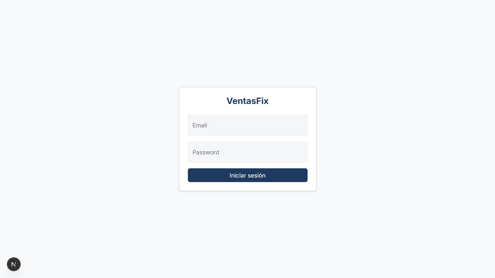

Login contra `admin@ventasfix.cl`. El JWT nunca es accesible desde el
navegador: se setea como cookie `httpOnly` en la respuesta del BFF (ver
2.2), visible solo desde las DevTools, no desde `document.cookie`:

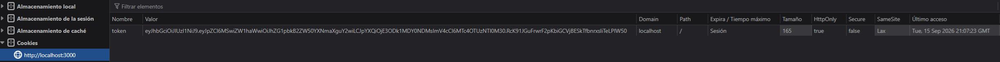

### 6.2 Usuario

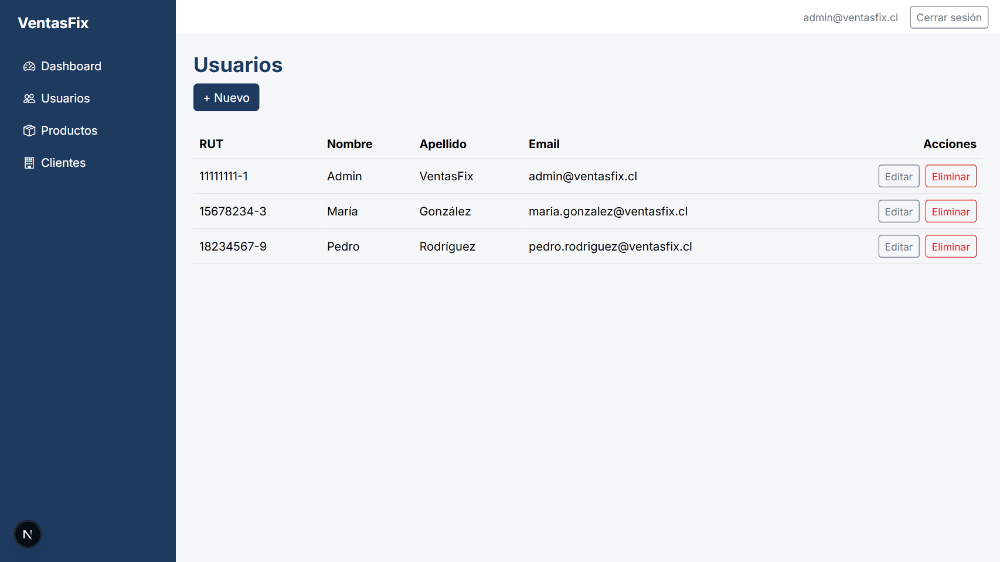

Validación de dominio de email (BRIEF.md §3.1) rechazada antes de
llegar a la API:

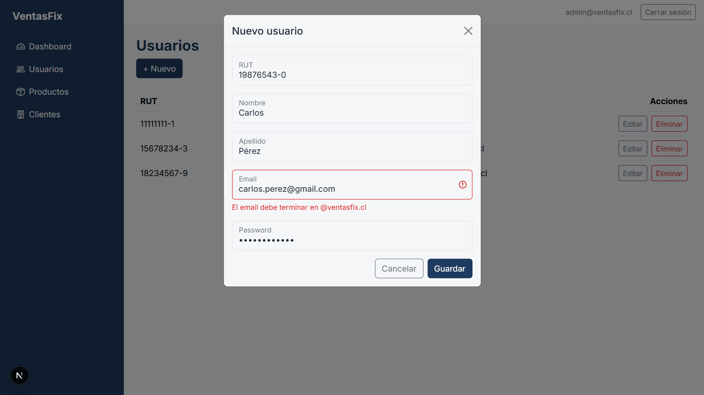

Las contraseñas se almacenan hasheadas con argon2id (ver 3.1), nunca en
texto plano — inspección directa de la tabla `Usuario`:

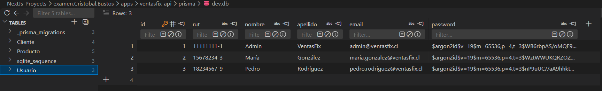

### 6.3 Producto

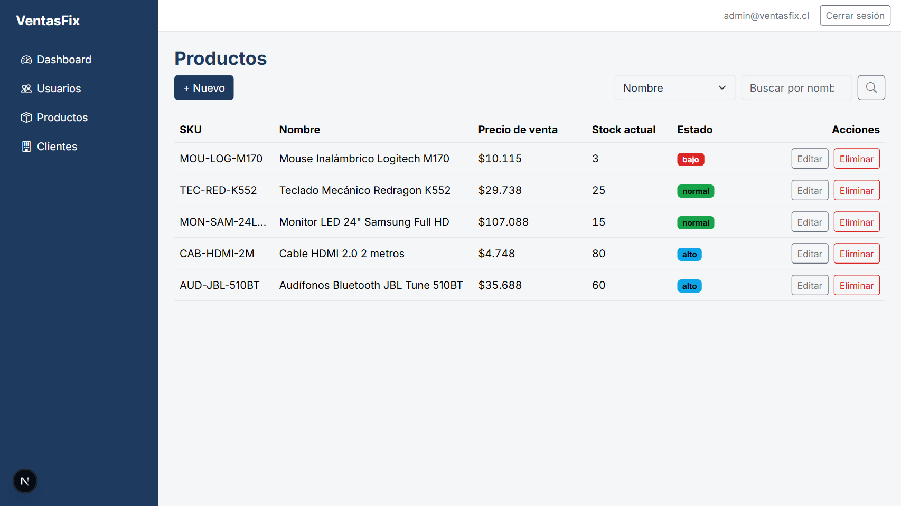

El campo `precio_de_venta` es de solo lectura, calculado en vivo a
partir de `precio_neto` (IVA 19% fijo, ver 3.3):

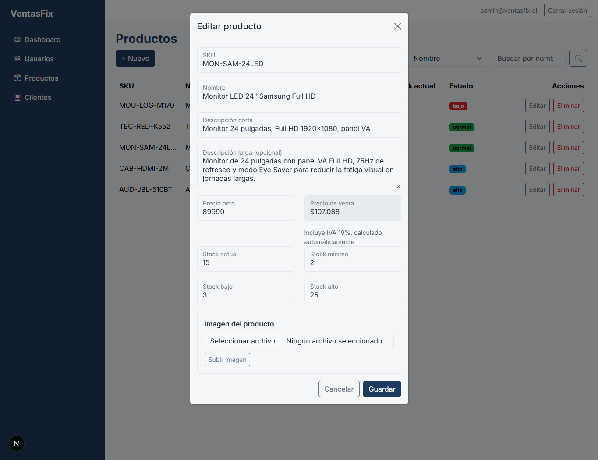

### 6.4 Cliente

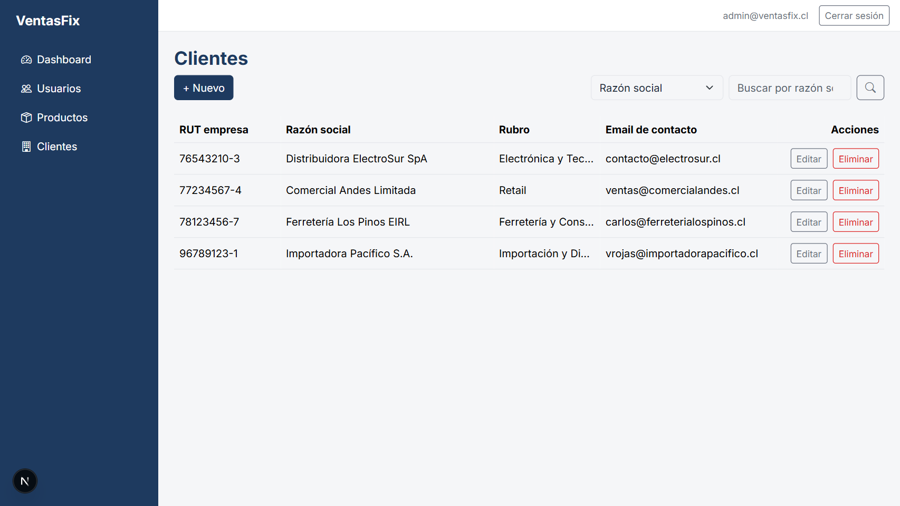

Buscador con selector de campo (razón social / RUT), filtrado en vivo
con debounce:

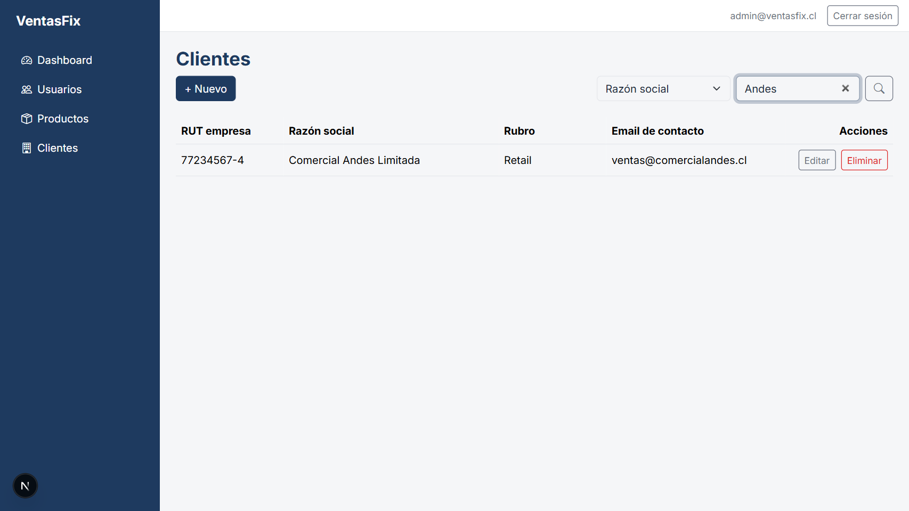

### 6.5 Dashboard

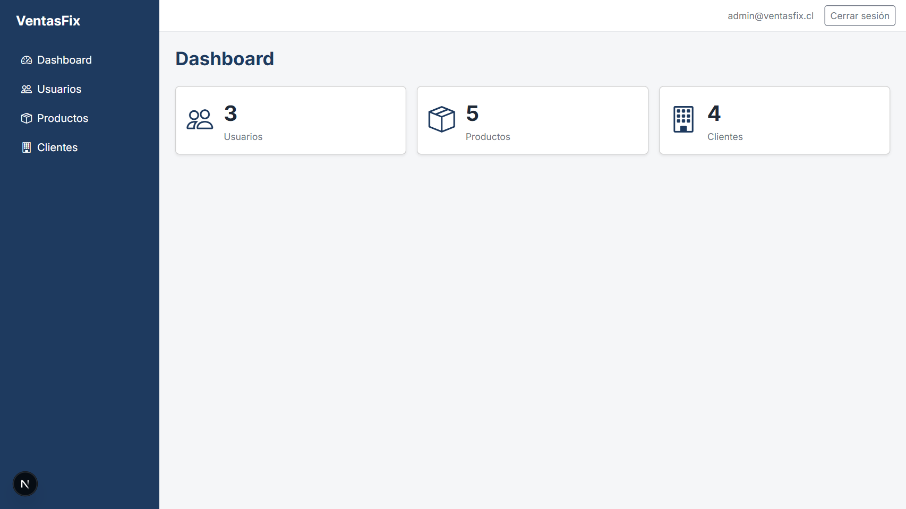

## 7. Documentación de la API

### 7.1 OpenAPI / Scalar

Con `ventasfix-api` corriendo (`npm run dev`, ver 5.5 — ambas rutas
viven en esa app, no en `ventasfix-web`):

- **UI interactiva (Scalar)**: `http://localhost:3001/api/docs`
- **Spec crudo (OpenAPI 3.1 JSON)**: `http://localhost:3001/api/openapi.json`

Ambas rutas son públicas a propósito (son documentación, no datos de
negocio) y se generan desde los mismos schemas Zod que validan cada
route handler (ver 3.1) — no hay una definición de OpenAPI escrita a
mano que pueda desincronizarse del código real.

Ejemplo, `POST /api/auth/login`: Scalar muestra el body requerido
(`email`, `password`) y los tres códigos de respuesta reales del
endpoint — `200` con el JWT (`{ token: string }`), `400` si falta
`email` o `password`, y `401` con el mismo mensaje genérico tanto si
el email no existe como si la contraseña es incorrecta (evita
enumeration de usuarios registrados):

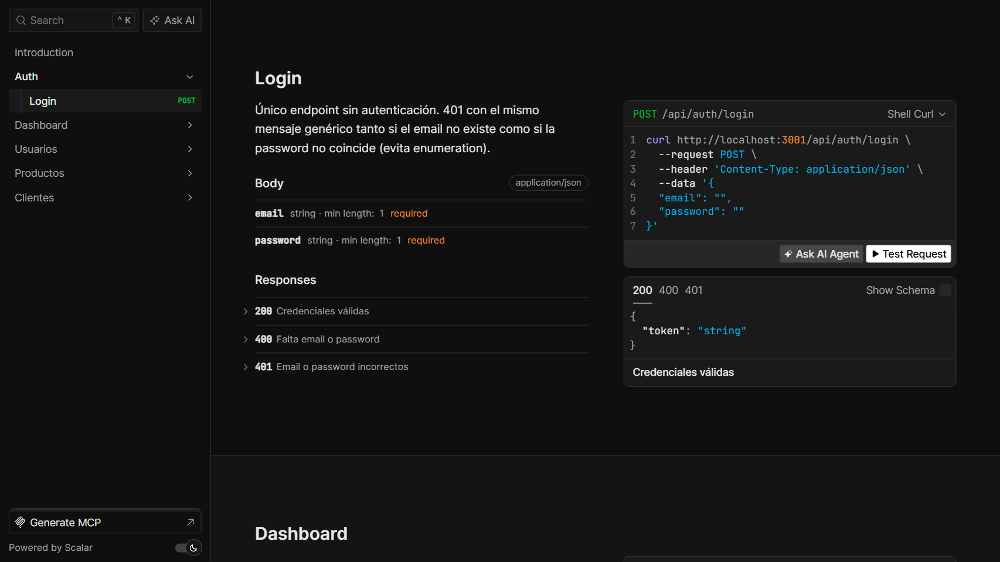

## 8. Herramientas y metodología de trabajo

### 8.1 Entorno de desarrollo

Terminal [Warp](https://www.warp.dev/), con **Oh My Pi** como prompt
engine (orquesta el acceso a herramientas — shell, edición de
archivos, navegador — del agente de código).

### 8.2 Agentes de IA usados

- **Claude Sonnet 5, en modo agéntico dentro de Warp**: implementación
  directa de código, ejecución de comandos (`npm`, `git`, `prisma`,
  `curl`), y verificación en navegador (capturas, interacción real con
  la UI, no simulada).
- **Claude (Sonnet 5), como soporte de planificación y decisión**:
  usado para revisar cada plan antes de implementarlo, resolver
  ambigüedades del enunciado/rúbrica, y validar (o cuestionar) el
  trabajo del agente de código antes de aceptarlo.

### 8.3 Metodología de trabajo con IA

Ciclo aplicado por vertical pequeña (una entidad o feature a la vez,
nunca varias en paralelo): **plan → confirmación → implementación →
verificación manual → commit**. Cada plan se revisó antes de autorizar
la implementación; cada resultado se verificó manualmente (Postman,
navegador, Prisma Studio) antes de aceptarlo como terminado. El uso de
IA no sustituyó la revisión y decisión propias en ningún paso,
incluidas correcciones a interpretaciones erróneas del agente cuando
ocurrieron (ej. ver 3.3.3, 3.3.4).

### 8.4 Alcance del uso de IA

Prácticamente todo el ciclo de desarrollo — código, documentación, y
esta misma sección del README — se apoyó en IA, con supervisión activa
en cada paso en vez de aceptación automática de resultados.
